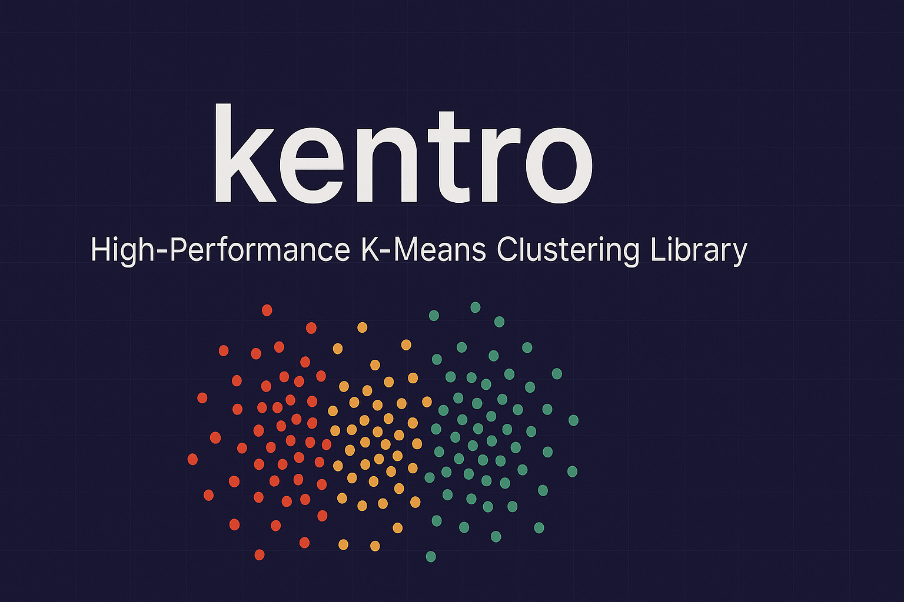

<p align="center">
    
    <h1 align="center">Kentro - High-Performance K-Means Clustering Library</h1>
</p>

[](https://www.rust-lang.org)
[](https://github.com/pisa-engine/kentro/actions)
[](https://crates.io/crates/kentro)
[](https://docs.rs/kentro)
[](https://opensource.org/licenses/Apache-2-0)

A high-performance Rust implementation of K-Means clustering algorithms. Kentro provides both standard and advanced K-Means variants with parallel processing support.

## 🚀 Features

- **Standard K-Means**: Classic Lloyd's algorithm implementation
- **Spherical K-Means**: Uses cosine similarity instead of Euclidean distance
- **Balanced K-Means**: Ensures clusters have similar sizes using efficient balancing algorithms
- **Parallel Processing**: Multi-threaded execution using Rayon
- **Flexible API**: Builder pattern for easy configuration
- **Memory Efficient**: Optimized for large datasets
- **Comprehensive Error Handling**: Detailed error types and messages

## 📦 Installation

Add this to your `Cargo.toml`:

```toml
[dependencies]
kentro = "0.1.0"
ndarray = "0.15"
```

## 🔧 Quick Start

```rust
use kentro::KMeans;
use ndarray::Array2;

// Create sample data (100 points, 2 dimensions)
let data = Array2::from_shape_vec((100, 2), 
    (0..200).map(|x| x as f32).collect()).unwrap();

// Create and configure K-Means
let mut kmeans = KMeans::new(3)
    .with_iterations(50)
    .with_verbose(true);

// Train the model
let clusters = kmeans.train(data.view(), None).unwrap();

println!("Found {} clusters", clusters.len());
for (i, cluster) in clusters.iter().enumerate() {
    println!("Cluster {}: {} points", i, cluster.len());
}
```

## 📚 API Reference

### Creating a K-Means Instance

```rust
use kentro::KMeans;

let kmeans = KMeans::new(3)                    // 3 clusters
    .with_iterations(50)                       // 50 iterations (default: 25)
    .with_euclidean(true)                      // Use Euclidean distance (default: false)
    .with_balanced(true)                       // Enable balanced clustering (default: false)
    .with_max_balance_diff(10)                 // Max cluster size difference (default: 16)
    .with_verbose(true);                       // Enable verbose output (default: false)
```

### Training

```rust
// Train on your data
let clusters = kmeans.train(data.view(), Some(4))?; // Use 4 threads

// Returns Vec<Vec<usize>> where each inner vector contains 
// the indices of points assigned to that cluster
```

### Assignment

```rust
// Assign new points to existing clusters
let assignments = kmeans.assign(new_data.view(), 1)?; // k=1 (nearest cluster)

// Multi-assignment (assign to k nearest clusters)
let multi_assignments = kmeans.assign(new_data.view(), 2)?; // k=2
```

### Accessing Results

```rust
// Get centroids
if let Some(centroids) = kmeans.centroids() {
    println!("Centroids shape: {:?}", centroids.dim());
}

// Check model state
println!("Trained: {}", kmeans.is_trained());
println!("Clusters: {}", kmeans.n_clusters());
println!("Euclidean: {}", kmeans.is_euclidean());
println!("Balanced: {}", kmeans.is_balanced());
```

## 🎯 Algorithm Variants

### Standard K-Means
Uses cosine similarity (inner product) as the distance metric. Suitable for high-dimensional data and text clustering.

```rust
let mut kmeans = KMeans::new(5);
```

### Euclidean K-Means
Uses Euclidean distance as the distance metric. Better for geometric data.

```rust
let mut kmeans = KMeans::new(5).with_euclidean(true);
```

### Balanced K-Means
Ensures clusters have similar sizes using the algorithm from:
> Rieke de Maeyer, Sami Sieranoja, and Pasi Fränti. "Balanced k-means revisited." Applied Computing and Intelligence, 3(2):145–179, 2023.

```rust
let mut kmeans = KMeans::new(5)
    .with_balanced(true)
    .with_max_balance_diff(10);
```

## ⚡ Performance Features

### Parallel Processing
Kentro automatically uses all available CPU cores for cluster assignment. You can control the number of threads:

```rust
// Use 4 threads
let clusters = kmeans.train(data.view(), Some(4))?;

// Use all available cores (default)
let clusters = kmeans.train(data.view(), None)?;
```

### Memory Efficiency
- Uses `ndarray` for efficient matrix operations
- Minimal memory allocations during iterations
- Supports large datasets through optimized algorithms

## 🔍 Examples

### Basic Clustering

```rust
use kentro::KMeans;
use ndarray::Array2;

fn basic_example() -> Result<(), Box<dyn std::error::Error>> {
    // Generate sample data
    let data = Array2::from_shape_vec((300, 2), 
        generate_sample_data(300, 2))?;
    
    // Cluster into 3 groups
    let mut kmeans = KMeans::new(3).with_verbose(true);
    let clusters = kmeans.train(data.view(), None)?;
    
    // Print results
    for (i, cluster) in clusters.iter().enumerate() {
        println!("Cluster {}: {} points", i, cluster.len());
    }
    
    Ok(())
}
```

### Balanced Clustering

```rust
fn balanced_example() -> Result<(), Box<dyn std::error::Error>> {
    let data = Array2::from_shape_vec((1000, 10), 
        generate_high_dim_data(1000, 10))?;
    
    let mut kmeans = KMeans::new(5)
        .with_balanced(true)
        .with_max_balance_diff(20)
        .with_iterations(100);
    
    let clusters = kmeans.train(data.view(), None)?;
    
    // Verify balance
    let sizes: Vec<usize> = clusters.iter().map(|c| c.len()).collect();
    let max_size = *sizes.iter().max().unwrap();
    let min_size = *sizes.iter().min().unwrap();
    
    println!("Cluster size range: {} - {} (diff: {})", 
             min_size, max_size, max_size - min_size);
    
    Ok(())
}
```

### Text Clustering (Spherical K-Means)

```rust
fn text_clustering_example() -> Result<(), Box<dyn std::error::Error>> {
    // Assume we have TF-IDF vectors
    let tfidf_vectors = load_tfidf_data()?; // Your TF-IDF data
    
    // Use spherical K-Means (cosine similarity)
    let mut kmeans = KMeans::new(10)
        .with_euclidean(false)  // Use cosine similarity
        .with_iterations(50);
    
    let clusters = kmeans.train(tfidf_vectors.view(), None)?;
    
    println!("Clustered {} documents into {} topics", 
             tfidf_vectors.nrows(), clusters.len());
    
    Ok(())
}
```

## 🛠️ Error Handling

Kentro provides comprehensive error handling:

```rust
use kentro::{KMeans, KMeansError};

match kmeans.train(data.view(), None) {
    Ok(clusters) => println!("Success: {} clusters", clusters.len()),
    Err(KMeansError::InsufficientPoints(n, k)) => {
        println!("Error: {} points < {} clusters", n, k);
    },
    Err(KMeansError::AlreadyTrained) => {
        println!("Error: Model already trained");
    },
    Err(e) => println!("Error: {}", e),
}
```

## 🧪 Testing

Run the test suite:

```bash
cargo test
```

Run with verbose output:

```bash
cargo test -- --nocapture
```

## 🚀 Running Examples

```bash
# Run the main example
cargo run --example simple

# Run with release optimizations
cargo run --example simple --release
```

## 📊 Benchmarks

Kentro is designed for high performance:

- **Parallel Processing**: Scales with CPU cores
- **Memory Efficient**: Minimal allocations during clustering
- **Optimized Algorithms**: Based on proven efficient implementations

## 📄 License

This project is licensed under the Apache 2.0 License - see the [LICENSE](LICENSE) file for details.
